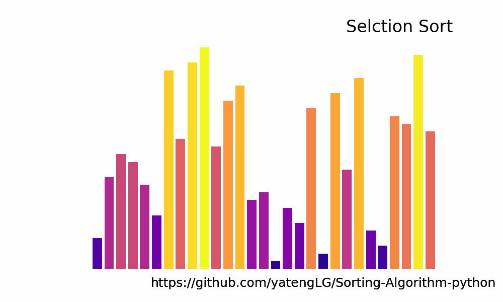

# Sorting-Algorithm-python
排序算法实现(基于python, 带动图展示)All Sorting-Algorithm  Implementation based on Python. (GIF display)  

冒泡排序(Bubble Sort)
```text
基本思想:
    两个数比较大小，较大的数下沉，较小的数冒起来。

过程：
    1. 从前向后两两比较，一直到比较最后两个数据
    2. 比较相邻的两个数据，如果前一个数大，就交换位置。每次都可以找出当前最大值.
    3. 继续重复上述过程，依次将第2.3...n-1个最小数排好位置。
    4. 最终最小数被交换到起始的位置，这样第一个最小数的位置就排好了。

平均时间复杂度：
    O(n2)
```


选择排序(Selction Sort)
```text
基本思想：
    在长度为N的无序数组中，第一次遍历n-1个数，找到最小的数值与第一个元素交换；
    第二次遍历n-2个数，找到最小的数值与第二个元素交换；
    ...
    第n-1次遍历，找到最小的数值与第n-1个元素交换，排序完成。
过程:
    1. 找最大数
    2. 放到对应位置
    ...
平均时间复杂度:
    O(n2)
```



插入排序(Insertion Sort)

希尔排序(Shell Sort)

快速排序(Quick Sort)

归并排序(Merge Sort)

堆排序(Heap Sort)

基数排序(Radix Sort)

未写完,存在很多错误,写完再看
